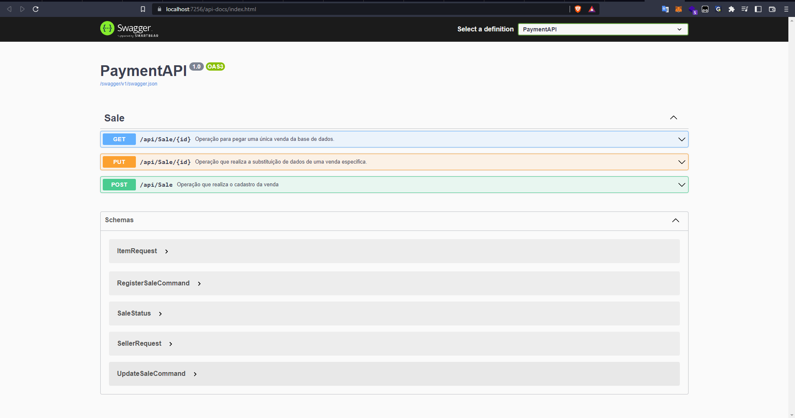
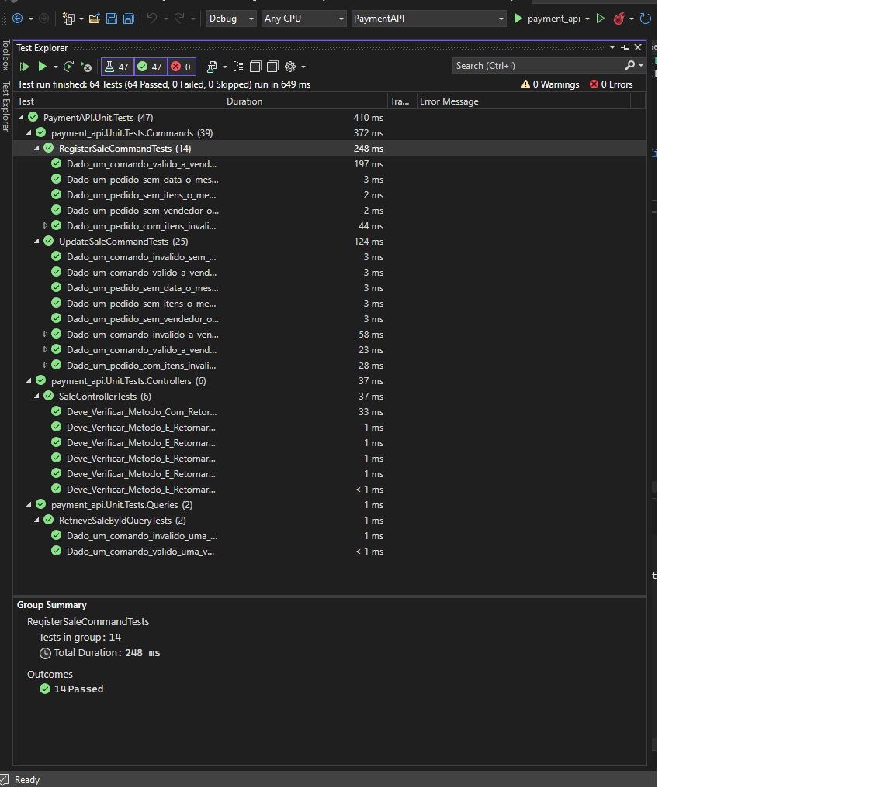

## Rodando a Aplicação localmente
Para rodar a aplica��o localmente, o dotnet 6.0 precisar estar instalado, e seguir com os seguintes comandos:
1. `cd payment-api`
2. `dotnet run`

No seu navegador, entre no seguinte Link:
```
https://localhost:7256/api-docs/index.html
```




### Arquitetura e Organiza��o

Para o desenvolvimento do sistema foi utilizada a arquitetura de camadas baseada no modelo Domain Driven Design da figura abaixo. 


Cada projeto representa uma camada. As responsabilidades de cada camada s�o:

	- Apresenta��o: intera��o com o usu�rio (A apresenta��o n�o tem nesse projeto);
	- Servi�os Distribuidos: disponibiliza endpoints para serem utilizados pela camada de apresenta��o (Projeto PaymentAPI);
	- Aplica��o: gerencia os recursos da solu��o (Projeto PaymentAPI.Application);
	- Dom�nio: cont�m os objetos e as regras de neg�cio (Projeto PaymentAPI.Domain);
	- Infraestrutura: servi�os externos e camada de acesso � dados (Projeto PaymentAPI.Infra.EF).